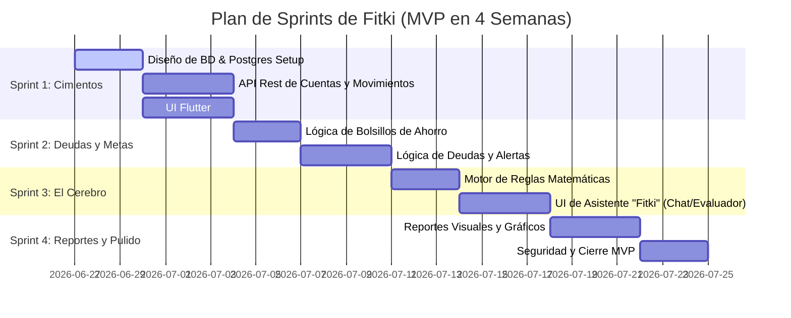

# Especificación del Proyecto: FITKI 🧠💵
### *Tu Entrenador Financiero Personal y Dashboard de Patrimonio Neto*

Este documento establece la definición, el alcance, los requerimientos de software y la metodología de desarrollo profesional para **Fitki**.

---

## 1. Declaración de Objetivos (Project Charter)

### Objetivo General
Desarrollar una plataforma digital responsiva (móvil y web) que centralice el patrimonio neto del usuario, rastree sus flujos de caja (ingresos, gastos, deudas y metas de ahorro) y provea un asistente inteligente basado en reglas financieras para evitar compras impulsivas y asegurar la salud financiera del usuario.

### Objetivos Específicos
1. **Centralización Patrimonial:** Integrar múltiples cuentas financieras (bancos, efectivo, billeteras digitales) en un único valor en tiempo real (Net Worth).
2. **Control de Flujos:** Registrar ingresos y gastos categorizados con un flujo de interacción rápido y sencillo.
3. **Optimización del Ahorro:** Permitir la creación de "Bolsillos Virtuales" y proponer de forma dinámica aportes a los frentes de ahorro.
4. **Control de Deudas:** Prevenir el pago de intereses moratorios mediante el cálculo de cuotas de amortización y alertas de fechas de corte y de pago.
5. **Asistente Consejero:** Proveer una interfaz conversacional/formulario rápida donde el usuario pueda consultar si tiene capacidad financiera real para realizar un gasto no planificado.

---

## 2. Requerimientos del Sistema

### 🛠️ Requerimientos Funcionales (RF)

#### RF-1: Gestión de Cuentas y Patrimonio Neto
* El usuario podrá dar de alta cuentas de diferentes tipos (Ahorro, Corriente, Efectivo, Tarjeta de Crédito).
* El sistema calculará el **Patrimonio Neto** = `Suma de activos (cuentas con saldo positivo)` - `Suma de pasivos (deudas registradas y saldos negativos de tarjetas de crédito)`.
* Visualización centralizada en un Dashboard principal del balance total y el balance individual por cuenta.

#### RF-2: Gestión de Movimientos (Ingresos y Gastos)
* Registro rápido de transacciones indicando monto, fecha, tipo (Ingreso/Gasto), categoría (Comida, Servicios, Ocio, etc.) y la cuenta asociada.
* Almacenamiento e historial de transacciones con filtros por rango de fechas, cuenta y categoría.
* El sistema deberá actualizar automáticamente el saldo de la cuenta elegida en base a la transacción.

#### RF-3: Frentes de Ahorro (Metas / Bolsillos Virtuales)
* El usuario podrá crear metas de ahorro definiendo un nombre, monto objetivo y fecha límite.
* El sistema calculará la **cuota mensual de ahorro requerida** para alcanzar la meta a tiempo.
* Al registrarse un ingreso, el sistema sugerirá la distribución de capital hacia las metas activas.

#### RF-4: Módulo de Deudas
* Registro de obligaciones financieras: monto total, tasa de interés, valor de la cuota mensual y fecha de vencimiento.
* Alertas preventivas previas a la fecha límite de pago para evitar el cobro de intereses de mora.

#### RF-5: El Asistente "Fitki" (Motor de Reglas)
* Interfaz de chat o formulario para preguntar: *"¿Puedo comprar esto?"* especificando el valor y opcionalmente la categoría.
* **Algoritmo de Decisión:**
  $$\text{Capacidad Libre} = (\text{Saldo de Cuentas} + \text{Ingresos del Mes}) - (\text{Gastos Fijos} + \text{Cuotas de Deuda} + \text{Ahorro Obligatorio de Metas})$$
* **Respuestas Dinámicas:**
  * **SÍ (Verde):** Si el costo de la compra $\le \text{Capacidad Libre}$.
  * **NO (Rojo):** Si el costo de la compra $> \text{Capacidad Libre}$. El asistente indicará qué meta de ahorro o pago se vería afectado o retrasado si decide hacer la compra de todos modos.

---

### 🧱 Requerimientos No Funcionales (RNF)

1. **Persistencia de Datos (PostgreSQL):** Consistencia ACID estricta para el manejo de dinero y transacciones. No se permiten pérdidas ni duplicidad de registros financieros.
2. **Seguridad y Cifrado:**
   * Cifrado de contraseñas de usuario con hash seguro (Argon2 / bcrypt).
   * Tokenización de APIs (JWT o Django REST Token Auth) para comunicación segura entre Frontend y Backend.
3. **Disponibilidad y Rendimiento:**
   * El cálculo del Asistente "Fitki" debe ejecutarse en menos de 200 ms.
   * La aplicación móvil debe ser responsiva y funcionar de manera óptima en pantallas pequeñas.
4. **Arquitectura Escalable:** Desacoplamiento total entre la lógica del backend (API en Django) y la interfaz de usuario (Flutter), permitiendo en el futuro agregar IA (OpenAI API) sin alterar el core del backend.

---

## 3. Modelo de Ciclo de Vida del Software (Metodología Ágil)

Adoptaremos un enfoque iterativo basado en **Scrum** con Sprints semanales para asegurar entregas continuas y validaciones constantes.

---

## 4. Aseguramiento de Calidad (QA) y Verificación

Para garantizar que el software se desarrolle de manera profesional, implementaremos:
* **Pruebas Unitarias en Backend:** Validación de la lógica de balance, suma/resta en cuentas ante transacciones y correcto funcionamiento del motor de reglas matemáticas (especialmente en valores límite y negativos).
* **Integridad de Base de Datos:** Llaves foráneas con eliminación en cascada controlada y transacciones atómicas para operaciones compuestas (ej. transferencias entre cuentas).
* **Pruebas de Usabilidad en Flutter:** Probar la velocidad de registro de transacciones para asegurar que no tome más de 3 segundos para el usuario.
