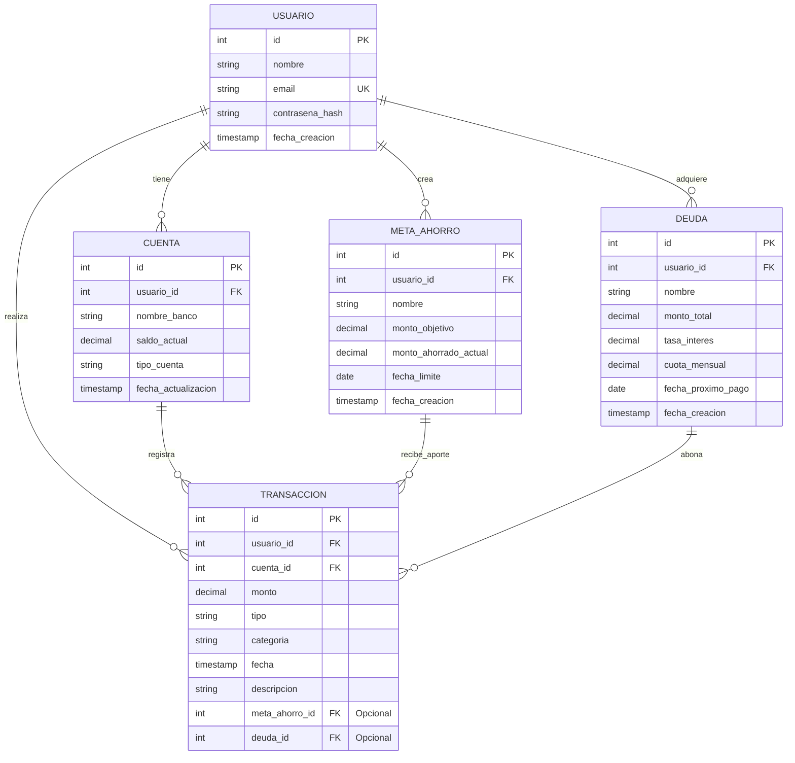

# Modelo Entidad-Relación (MER) - Fitki 🧠💵

Este documento detalla la estructura lógica de la base de datos de **Fitki**, diseñada para actuar como el núcleo financiero del Entrenador Financiero Personal.

---

## 📊 Diagrama Entidad-Relación (ERD)

A continuación se muestra cómo se relacionan las tablas principales de la base de datos de Fitki.

---

## 🗂️ Diccionario de Datos Detallado

Utilizaremos tipos de datos altamente precisos para el manejo de dinero (`DECIMAL(15,2)`) para evitar problemas de precisión de punto flotante.

### 1. Tabla: `Usuario`
Almacena la información de autenticación y perfil del usuario.

| Campo | Tipo de Dato | Restricciones | Descripción |
| :--- | :--- | :--- | :--- |
| `id` | `INT` / `SERIAL` | `PRIMARY KEY`, Auto-incremental | Identificador único de cada usuario. |
| `nombre` | `VARCHAR(100)` | `NOT NULL` | Nombre completo del usuario. |
| `email` | `VARCHAR(150)` | `NOT NULL`, `UNIQUE`, `INDEX` | Correo electrónico (usado para inicio de sesión). |
| `contrasena_hash`| `VARCHAR(255)` | `NOT NULL` | Contraseña cifrada con un algoritmo seguro (ej. Argon2 o bcrypt). |
| `fecha_creacion` | `TIMESTAMP` | `DEFAULT CURRENT_TIMESTAMP` | Fecha y hora de registro. |

---

### 2. Tabla: `Cuenta`
Representa los lugares físicos o virtuales donde el usuario tiene dinero o deudas de tipo tarjeta de crédito.

| Campo | Tipo de Dato | Restricciones | Descripción |
| :--- | :--- | :--- | :--- |
| `id` | `INT` / `SERIAL` | `PRIMARY KEY` | Identificador único de la cuenta. |
| `usuario_id` | `INT` | `FOREIGN KEY` -> `Usuario(id)` | Usuario propietario de la cuenta. |
| `nombre_banco` | `VARCHAR(100)` | `NOT NULL` | Nombre de la cuenta (Ej: "Bancolombia", "Efectivo", "Nequi"). |
| `saldo_actual` | `DECIMAL(15,2)` | `DEFAULT 0.00` | Saldo actual disponible. |
| `tipo_cuenta` | `VARCHAR(50)` | `NOT NULL` | Limitado a: `Ahorros`, `Corriente`, `Efectivo` (o ENUM). |
| `fecha_actualizacion`| `TIMESTAMP` | `DEFAULT CURRENT_TIMESTAMP` | Última vez que se modificó el saldo. |

---

### 3. Tabla: `Transaccion`
Registra todo flujo de dinero de entrada (ingreso) o salida (gasto).

> [!NOTE]
> **Mejora de Diseño propuesta:** Además de `usuario_id`, hemos añadido `cuenta_id`. Esto es crucial para poder restar o sumar automáticamente del `saldo_actual` de la cuenta correspondiente cuando se realiza un movimiento. También se añaden referencias opcionales a `meta_ahorro_id` y `deuda_id` para vincular transacciones de ahorro o abonos a deudas.

| Campo | Tipo de Dato | Restricciones | Descripción |
| :--- | :--- | :--- | :--- |
| `id` | `INT` / `SERIAL` | `PRIMARY KEY` | Identificador único del movimiento. |
| `usuario_id` | `INT` | `FOREIGN KEY` -> `Usuario(id)` | Usuario que realiza el movimiento. |
| `cuenta_id` | `INT` | `FOREIGN KEY` -> `Cuenta(id)` | Cuenta de la cual sale o a la cual ingresa el dinero. |
| `monto` | `DECIMAL(15,2)` | `NOT NULL`, `> 0` | Valor monetario de la transacción. |
| `tipo` | `VARCHAR(10)` | `NOT NULL` | Limitado a: `INGRESO` o `GASTO`. |
| `categoria` | `VARCHAR(50)` | `NOT NULL` | Categoría (Ej: "Comida", "Transporte", "Salario"). |
| `fecha` | `TIMESTAMP` | `NOT NULL` | Fecha y hora en que ocurrió el movimiento. |
| `descripcion` | `VARCHAR(255)` | `NULL` | Detalle opcional (Ej: "Almuerzo de trabajo"). |
| `meta_ahorro_id` | `INT` | `FOREIGN KEY` -> `MetaAhorro(id)`, `NULL` | Si el gasto/ingreso fue para alimentar un bolsillo virtual. |
| `deuda_id` | `INT` | `FOREIGN KEY` -> `Deuda(id)`, `NULL` | Si la transacción corresponde al abono/pago de una deuda. |

---

### 4. Tabla: `MetaAhorro` (Frentes de Ahorro / Bolsillos)
Metas a mediano/largo plazo configuradas por el usuario.

| Campo | Tipo de Dato | Restricciones | Descripción |
| :--- | :--- | :--- | :--- |
| `id` | `INT` / `SERIAL` | `PRIMARY KEY` | Identificador único de la meta. |
| `usuario_id` | `INT` | `FOREIGN KEY` -> `Usuario(id)` | Usuario dueño de la meta. |
| `nombre` | `VARCHAR(100)` | `NOT NULL` | Nombre de la meta (Ej: "Viaje a Europa", "Fondo Emergencia"). |
| `monto_objetivo` | `DECIMAL(15,2)` | `NOT NULL` | Meta financiera total. |
| `monto_ahorrado_actual`| `DECIMAL(15,2)`| `DEFAULT 0.00` | Cantidad acumulada hasta el momento. |
| `fecha_limite` | `DATE` | `NOT NULL` | Fecha objetivo para completar el ahorro. |
| `fecha_creacion` | `TIMESTAMP` | `DEFAULT CURRENT_TIMESTAMP` | Fecha de creación de la meta. |

---

### 5. Tabla: `Deuda`
Préstamos o tarjetas de crédito cuyo pago debe rastrearse y alertarse.

| Campo | Tipo de Dato | Restricciones | Descripción |
| :--- | :--- | :--- | :--- |
| `id` | `INT` / `SERIAL` | `PRIMARY KEY` | Identificador único de la deuda. |
| `usuario_id` | `INT` | `FOREIGN KEY` -> `Usuario(id)` | Usuario titular de la deuda. |
| `nombre` | `VARCHAR(100)` | `NOT NULL` | Nombre de la obligación (Ej: "Tarjeta Visa", "Crédito Icetex"). |
| `monto_total` | `DECIMAL(15,2)` | `NOT NULL` | Monto restante de la deuda. |
| `tasa_interes` | `DECIMAL(5,2)` | `NOT NULL` | Tasa de interés expresada en porcentaje (Ej: `2.50` para 2.50%). |
| `cuota_mensual` | `DECIMAL(15,2)` | `NOT NULL` | Cuota que debe pagarse periódicamente. |
| `fecha_proximo_pago`| `DATE` | `NOT NULL` | Fecha límite para el siguiente abono (útil para notificaciones). |
| `fecha_creacion` | `TIMESTAMP` | `DEFAULT CURRENT_TIMESTAMP` | Registro inicial de la obligación. |

---

## 🛠️ Integridad Referencial y Reglas del Negocio (Cascadas)

1. **Eliminación de Usuario (`ON DELETE CASCADE`):** Si un usuario elimina su cuenta, todas sus cuentas asociadas, transacciones, metas de ahorro y deudas deben borrarse para proteger la privacidad de los datos y evitar registros huérfanos.
2. **Cuentas y Transacciones:** Una transacción no puede existir sin una cuenta asociada. Si se elimina una cuenta, sus transacciones asociadas también se eliminan en cascada (o se marcan como históricas/archivadas según preferencia del negocio).
3. **Manejo del Dinero con Decimales:** En PostgreSQL utilizaremos `NUMERIC(15, 2)` o `DECIMAL(15, 2)` para evitar cualquier imprecisión de cálculo matemático financiero común con floats o doubles.
